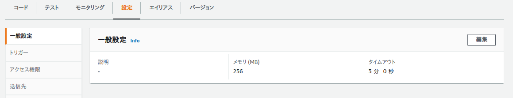
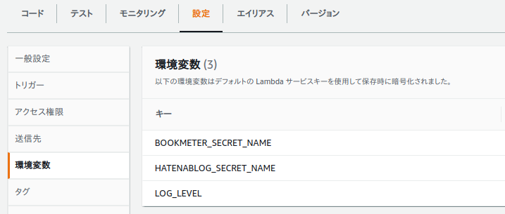
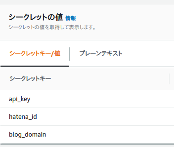
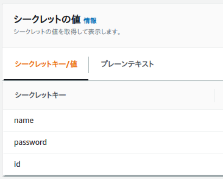

# post-bookmeter-summary-to-hatenablog

## 設定項目

事前に設定しておくべき項目を以下に示す。

## AWS Lambda

AWS Lambda に以下の値を設定しておくこと。

### 一般設定



- タイムアウト:3 分

### 環境変数



- BOOKMETER_SECRET_NAME
  - 意味：bookmeter のパスワードなどを格納したシークレットの名前
  - 例：`secrets/bookmeter`
- HATENABLOG_SECRET_NAME
  - 意味：はてなブログの API キーなどを格納したシークレットの名前
  - 例：`secrets/hatenablog`
- LOG_LEVEL
  - 意味：ログレベル `CRITICAL, ERROR, WARNING, INFO, DEBUG` から選択
  - 例：`DEBUG`

### Secrets

### Hatenablog



- api_key
  - 意味：Basic 認証用の API key。[ブログの詳細設定](http://blog.hatena.ne.jp/my/config/detail)画面から取得
  - 例：`21afjlij4224`
- hatena_id
  - 意味：あなたのはてな ID
  - 例：`hoge`
- blog_domain
  - 意味：ブログの ID
  - 例：`hoge.hatenablog.com`

### Bookmeter



- name
  - 意味：ユーザ名
  - 例：`kannkyo`
- password
  - 意味：パスワード
  - 例：`hogehoge`
- ID
  - 意味
    - 自分のプロフィール画面の URL に埋め込まれた番号
    - kannkyo ユーザの場合は URL が <https://bookmeter.com/users/764418>なので、ID は 764418
  - 例：`764418`

## 使い方

### ソースコードのアップロード

まず、aws-cli を事前に設定しておくこと。

```bash
aws configure
```

次に、アップロードスクリプトを実行すること。

```bash
./upload.sh
```
